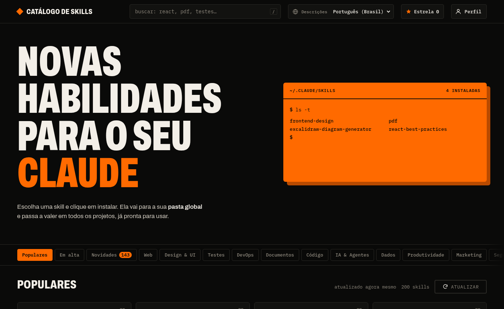
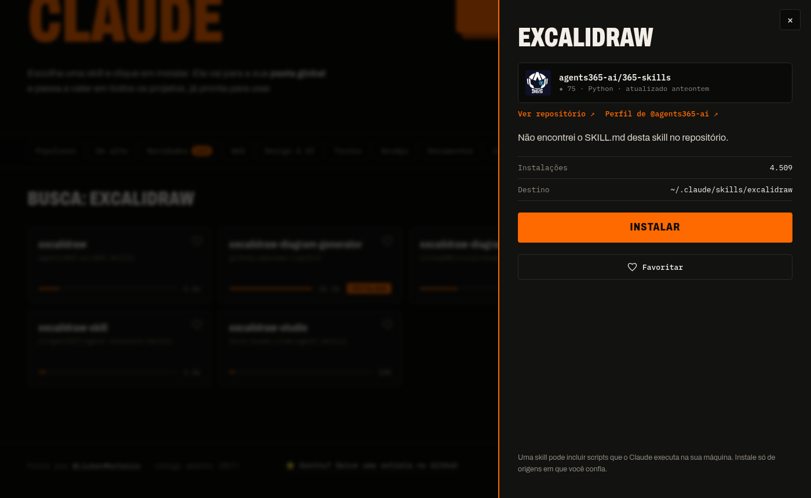

# Catálogo de Skills

[](https://github.com/LiukenMonteiro/CatalogoDeSkills)
[](LICENSE)

**Descubra e instale skills para o Claude Code com um clique.** Mais de 13 mil skills, busca instantânea, o que está em alta, o que acabou de chegar e as suas favoritas, tudo num site grátis, sem conta e sem terminal.

> *English:* a free catalog of 13k+ Claude Code / agent skills. Browse, search, and install any skill into your `~/.claude/skills` folder with one click, straight from the browser. Interface in Brazilian Portuguese.

**➡️ Abrir o site: https://liukenmonteiro.github.io/CatalogoDeSkills/**



## O que dá para fazer

- **Instalar com um clique.** O site grava a skill direto na sua pasta `~/.claude/skills`. Na primeira vez você escolhe a pasta (uma vez só); depois é só clicar em **Instalar**. A skill já vale em todos os seus projetos.
- **Achar o que importa.** Busca no catálogo inteiro, 12 categorias, **Em alta** (o que mais cresceu hoje) e **Novidades** (skills que acabaram de aparecer).
- **Conhecer antes de instalar.** Descrição traduzida para o seu idioma (os nomes ficam em inglês, para você conseguir buscar), dados do repositório (estrelas, linguagem, licença, última atualização), link para o autor e o `SKILL.md` completo para ler.
- **Aprender a usar.** A página **Guia** explica o que é uma skill e avisa o essencial: depois de instalada, é preciso pedir pelo nome ("use a skill X para…"). O painel de cada skill instalada já traz esse pedido pronto para copiar.
- **Guardar o que gostou.** Favoritas, perfil com nome e foto, exportar/importar e **link da sua coleção** para compartilhar com amigos.
- **Gerenciar o que já tem.** A aba *Instaladas* lê a sua pasta de skills, mostra a mais recente primeiro e desinstala com dois cliques.



## Como usar

### No site (recomendado)

1. Abra o site no **Chrome, Edge ou Opera** (computador). No **Brave** ou no Firefox, veja o quadro logo abaixo.
2. Escolha uma skill e clique em **Instalar**.
3. Na primeira vez, o site pede a pasta `.claude` do seu computador. Siga o passo a passo da janela e confirme em **Permitir**.

Pronto: a skill aparece no Claude Code, normalmente sem precisar reiniciar.

<details>
<summary>Usa o Brave (ou outro navegador sem gravação em pasta)?</summary>

O Brave traz a gravação em pasta **desligada por padrão**, e nenhum site consegue ligá-la. Você tem duas saídas:

1. **Instalar pelo terminal, sem mexer em nada.** O botão vira **Copiar comando de instalação**: cole o comando num terminal e aperte **Enter**. Ele clona o repositório da skill e copia só a pasta dela para `~/.claude/skills` (precisa do `git`; não usa o Claude). No Windows, ou se preferir, o painel oferece **pedir ao Claude Code** (VS Code, terminal ou copiar o pedido), pelos [links oficiais do Claude Code](https://code.claude.com/docs/en/deep-links); isso gasta tokens, e nada é enviado até você apertar Enter.
2. **Ligar o clique único no Brave (uma vez).** Cole `brave://flags/#file-system-access-api` na barra de endereço, mude a opção para **Enabled**, reinicie o Brave e volte ao site. O site mostra esse passo a passo, com um botão para copiar o endereço, quando detecta o Brave.

Firefox, Safari e o navegador embutido do VS Code ou do Cursor também usam a saída 1.
</details>

### Rodar na sua máquina (para quem desenvolve)

Precisa de [Node.js](https://nodejs.org) 18 ou mais novo e do `git`.

```bash
npx github:LiukenMonteiro/CatalogoDeSkills
# ou, clonando:
git clone https://github.com/LiukenMonteiro/CatalogoDeSkills.git
cd CatalogoDeSkills
node server.js
```

Abre `http://localhost:4173`. Nesse modo o servidor local instala com `git clone` na sua pasta de skills, e dá para entrar com o GitHub (opcional, veja abaixo).

| Variável | Para quê |
|---|---|
| `PORT` | Porta do servidor (padrão `4173`) |
| `SKILLS_DIR` | Pasta de skills (padrão `~/.claude/skills`) |
| `CATALOGO_CONFIG_DIR` | Onde guardar listas e sessão (padrão `~/.config/catalogo-de-skills`) |
| `GITHUB_CLIENT_ID` | Client ID do seu OAuth App, para o login com GitHub |
| `NO_OPEN=1` | Não abrir o navegador ao iniciar |

<details>
<summary>Login com GitHub no modo local (opcional)</summary>

O login usa o *device flow* do GitHub, sem servidor público e sem guardar token. É preciso um OAuth App seu, criado uma vez:

1. Crie um app em <https://github.com/settings/applications/new> (qualquer nome; em *Homepage URL* e *Callback URL* use `http://localhost:4173`).
2. Na página do app, marque **Enable Device Flow** e clique em *Update application*.
3. Clique em **Entrar com GitHub** no catálogo e cole o **Client ID**.

O catálogo só lê o seu nome e a sua foto públicos.
</details>

## Como funciona

```
                 a cada 6 horas (GitHub Actions)
  skills.sh ───────────────────────────────────────► data/catalog.json  (13 mil skills, ~200 KB comprimido)
                                                              │
                                                              ▼
   Seu navegador  ◄────────────  GitHub Pages  (site estático, sem servidor)
        │  │  │
        │  │  └──► api.github.com / raw.githubusercontent.com / jsDelivr   dados do repositório e arquivos da skill
        │  └─────► tradutor do Chrome (no seu computador) ou MyMemory   tradução das descrições
        └────────► sua pasta ~/.claude/skills   gravação direta (File System Access API)
```

- O **skills.sh** não aceita chamadas feitas direto do navegador, então uma tarefa agendada ([`update.yml`](.github/workflows/update.yml)) baixa o catálogo completo e o publica junto com o site. Quem decide o que é **novo** é essa tarefa: ela compara o catálogo de agora com o da execução anterior.
- **Não há servidor** para manter nem banco de dados. Favoritas e perfil ficam no `localStorage` do seu navegador.
- O código do site está em [`site/`](site), a camada que fala com GitHub, tradução e pasta em [`site/static-api.js`](site/static-api.js), e o rastreador em [`scripts/build-site.mjs`](scripts/build-site.mjs).

## Publicar a sua própria cópia

1. Faça um *fork* e edite [`site/config.json`](site/config.json) (repositório, usuário e endereço do site).
2. No GitHub: **Settings → Pages → Build and deployment → Source: GitHub Actions**.
3. Em **Actions**, rode o workflow *Atualizar catálogo e publicar o site* (a primeira execução leva uns 8 a 10 minutos, por causa do limite de consultas do skills.sh). Depois ele roda sozinho a cada 6 horas.

## Privacidade e segurança

- O site **não tem login, não coleta dados e não usa analytics.** O que você favorita e o seu perfil ficam só no seu navegador.
- A sua máquina conversa direto com o GitHub (dados e arquivos das skills) e com o serviço de tradução; o dono do site não recebe nada disso.
- A permissão de pasta é do navegador: o site só escreve na pasta que você escolheu, e você pode revogar quando quiser nas configurações do Chrome.
- **Uma skill pode trazer scripts e instruções que o Claude executa na sua máquina.** Leia o `SKILL.md`, olhe as estrelas e a data do repositório e instale só de origens em que você confia. O catálogo apenas aponta para as skills e baixa os arquivos direto da origem; ele não as hospeda.
- Salvaguardas do instalador: caminhos de arquivo são validados (nada de `..`), uma instalação que falha no meio é desfeita, e há um limite de 1000 arquivos / 64 MB por skill.

## Limitações conhecidas

- Arquivos gravados pelo navegador **não recebem o bit de executável** (o navegador não consegue defini-lo). Skills que trazem scripts feitos para rodar direto (`./script.sh`) podem precisar de `chmod +x`; os que rodam com `python script.py` ou `bash script.sh` funcionam normalmente.
- **Linux com navegador snap ou flatpak** (por exemplo o Brave ou o Chromium instalados pela loja do Ubuntu): o navegador roda isolado e o portal de documentos do sistema entrega a pasta escolhida só para leitura, então o clique único falha com *"An attempt was made to write to a file or directory…"*. Saídas: instalar o navegador em `.deb` ([brave.com/linux](https://brave.com/linux/)); usar **Copiar comando de instalação** (terminal) ou o modo local (`node server.js`); ou manter o clique único liberando a gravação só na pasta `skills`: no site, clique em Instalar, escolha `~/.claude/skills`, rode `python3 scripts/liberar-gravacao-linux.py` (mostra o que faria) e depois `python3 scripts/liberar-gravacao-linux.py --aplicar`. O script só altera a permissão dessa pasta; para desfazer, `gdbus call --session --dest org.freedesktop.portal.Documents --object-path /org/freedesktop/portal/documents --method org.freedesktop.portal.Documents.RevokePermissions ID_DO_DOCUMENTO APP "['write']"`.
- A busca procura no **nome, no repositório e nas palavras-chave** das skills, não no texto completo das descrições.
- Os dados do repositório (estrelas, linguagem) vêm da API pública do GitHub, que limita a 60 consultas por hora por computador. Quando o limite estoura, a descrição e a instalação continuam funcionando por uma reserva (jsDelivr); só as estrelas somem por alguns minutos. A tradução gratuita de reserva (MyMemory) também tem cota diária; o tradutor embutido do Chrome não tem limite.
- O catálogo é atualizado a cada 6 horas, não em tempo real.

## Ideias para o futuro

- Avisar quando uma skill instalada tiver versão mais nova e atualizar com um clique.
- Interface em inglês.
- Entrar com o GitHub para sincronizar as favoritas entre computadores.

Sugestões e *pull requests* são bem-vindos. Se o projeto te ajudou, **deixe uma ⭐ no repositório**: é o que mais ajuda ele a chegar em mais gente.

## Licença

[MIT](LICENSE) © 2026 Liuken Monteiro. As skills listadas pertencem aos seus autores e seguem as licenças dos respectivos repositórios. Os dados do catálogo vêm do [skills.sh](https://skills.sh).
